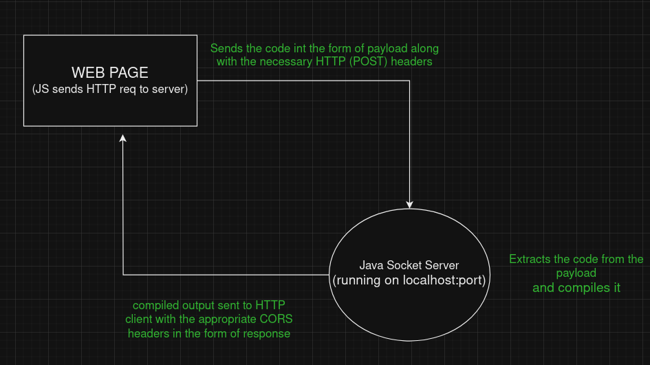
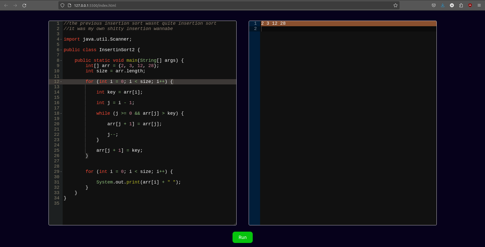

# Java HTTP and Socket Server for Compiling User-Provided Java Code  
(hosting online VM pending)

  
  

## Overview

This repository contains a Java program that serves as an HTTP and socket server capable of compiling and executing user-provided Java code remotely. The server offers a simple and secure way for users to submit Java code snippets, which are then compiled and executed on the server-side environment. This README provides an overview of the project, its features, usage instructions, technologies used, and how to contribute.

## Duration 

This project took me a total of 4-5 days to make. 
The first 3 days were used to hard code the backend using java, and the next 1-2 days were utilised in cleaning the code and also making a minimal frontend

## Key Features

- **HTTP and Socket Server**: Implements both HTTP and socket communication protocols, allowing users to choose their preferred method of interaction.
  
- **Java Code Compilation**: Dynamically compiles the Java code provided by users on-the-fly.
  
- **Code Execution**: Executes the compiled Java code and returns the output to the user.
  
- **ACE code editor**: Has been embedded to provide features like text highlighting, auto-completion, find text functionality etc etc
  

## Technologies Used

- **Java**: The core programming language used to develop the server application.
  
- **HTTP Server**: Leveraged Java's built-in HTTP server capabilities for handling HTTP requests.
  
- **Socket Programming**: Utilized Java's socket API for establishing socket connections and communication.
  
- **IOutils.class**: Implemented a custom class to provide utility to the socket server
  

## Usage

1. **Running the Server**: Execute the `ServerLogic.java` file to start the server on the desired host and port.
   
2. **Submitting Java Code**: Users can submit Java code either via HTTP POST requests or by establishing socket connections.
   
3. **Receiving Output**: Upon receiving Java code, the server compiles and executes it. Users receive the output or error messages generated by the code execution process.

## Repository Structure

- `ServerLogic.java`: The main Java source file containing the server implementation.
  
- `IOutils.class`: Utility class providing methods for creating input and output streams for sockets and processes.

## Contributing

Contributions to this project are welcome! If you find any bugs, have feature requests, or want to contribute improvements, please submit a pull request. Make sure to adhere to the project's coding standards and guidelines.

## License

This project is licensed under the [MIT License](link-to-license). You are free to use, modify, and distribute the code as per the terms of the license.

